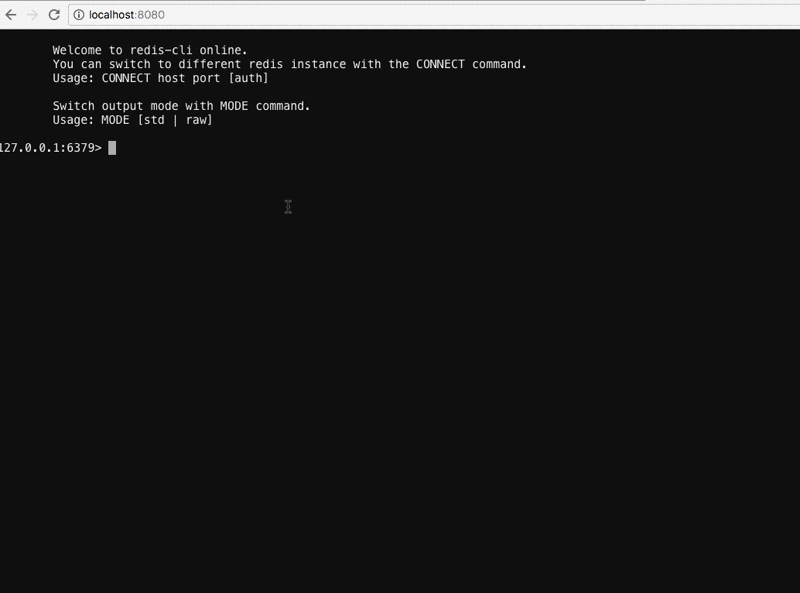

A pure Go Redis-cli 
==================
[](https://goreportcard.com/report/github.com/holys/redis-cli)

This is a simple redis-cli forked from [https://github.com/siddontang/ledisdb(ledis-cli)](https://github.com/siddontang/ledisdb).
Fully compatible with [Redis Protocol specification](https://redis.io/topics/protocol).


### Features 

- Pure Go implementation
- Full compatible with [Redis Protocol specification](https://redis.io/topics/protocol)
- Basic support for hostname, port, auth, db
- REPL 
- Non-interactively execute command 
- Raw format output
- Monitor command support (both in REPL and execution directly)
- CONNECT command support(example is as follows)

### Install 

To install, use `go get`
```
go get -u -v github.com/holys/redis-cli 
```

or download binary file from [release](https://github.com/holys/redis-cli/releases).

### Usage

```
$ ./redis-cli --help
Usage of ./redis-cli:
  -a string
        Password to use when connecting to the server
  -h string
        Server hostname (default "127.0.0.1")
  -n int
        Database number(default 0)
  -p int
        Server server port (default 6379)
  -raw
        Use raw formatting for replies
  -s string
        Server socket. (overwrites hostname and port)

Almost the same as the official redis-cli.

$ ./redis-cli
127.0.0.1:6379> get info
"{\"age\":1,\"name\":\"cdh\"}"

$ ./redis-cli --raw
127.0.0.1:6379> get info
{"age":1,"name":"cdh"}

$ ./redis-cli get info
"{\"age\":1,\"name\":\"cdh\"}"

$ ./redis-cli --raw get info
{"age":1,"name":"cdh"}

$ ./redis-cli monitor
OK
1483327130.764598 [0 127.0.0.1:61344] "PING"
1483327133.769646 [0 127.0.0.1:61344] "PING"
1483327136.768431 [0 127.0.0.1:61344] "PING"
1483327139.767084 [0 127.0.0.1:61344] "PING"
 ...

---
New command support: CONNECT host port [auth]

$ ./redis-cli
127.0.0.1:6379> set hostport "127.0.0.1:6379"
OK
127.0.0.1:6379> get hostport
"127.0.0.1:6379"
127.0.0.1:6379> connect 127.0.0.1 6380
connected 127.0.0.1:6380 successfully
127.0.0.1:6380> get hostport
(nil)
127.0.0.1:6380>
```


## Play with [GoTTY](https://github.com/yudai/gotty)

gotty -w  ./redis-cli --welcome




### Why I build this?

Sometimes I would like to access to the redis-server(or redis-proxy), but there is no redis-cli in the
the production machine which is controlled by the ops guys, and I don't have the root privilege to 
install one via apt-get or yum. Some people may ask that why don't you ask the ops guys for help? I just 
don't want to bother them because somtimes they are very busy, and I just want the redis-cli for single use.
People may be curious that why don't I git clone one from github and build it from source. 

Ok, let me show you:
```
git clone https://github.com/antirez/redis.git
Initialized empty Git repository in /home/work/app/redis/.git/
remote: Counting objects: 45784, done.
remote: Compressing objects: 100% (92/92), done.
Receiving objects:   0% (62/45784), 20.01 KiB | 5 KiB/s

Receiving objects:   0% (291/45784), 84.01 KiB | 1 KiB/s

Receiving objects:   2% (1242/45784), 300.01 KiB | 7 KiB/s
```

The network condition really drives me crazy.

People who has C/C++ backrground must know that you can't simply copy a linux executable file
from one machine to another and make it run successfully, because sometimes the target machine
lacks of the matched glibc or other .so files.

```
$ ldd redis-cli
    linux-vdso.so.1 =>  (0x00007fffe93fe000)
    libm.so.6 => /lib/x86_64-linux-gnu/libm.so.6 (0x00007f17ff5f9000)
    libpthread.so.0 => /lib/x86_64-linux-gnu/libpthread.so.0 (0x00007f17ff3db000)
    libc.so.6 => /lib/x86_64-linux-gnu/libc.so.6 (0x00007f17ff015000)
    /lib64/ld-linux-x86-64.so.2 (0x00007f17ff919000)
```

So I just want a pure go solution，build once, and run everywhere(aha Java).

Please correct me if I am wrong.


### Contributing

1. Fork it
2. Create your feature branch (git checkout -b my-new-feature)
3. Commit your changes (git commit -am 'Add some feature')
4. Push to the branch (git push origin my-new-feature)
5. Create new Pull Request


### LICENSE

MIT LICENSE, see [LICENSE](./LICENSE) for details.

### Author

[David Chen (a.k.a holys)](https://github.com/holys)
